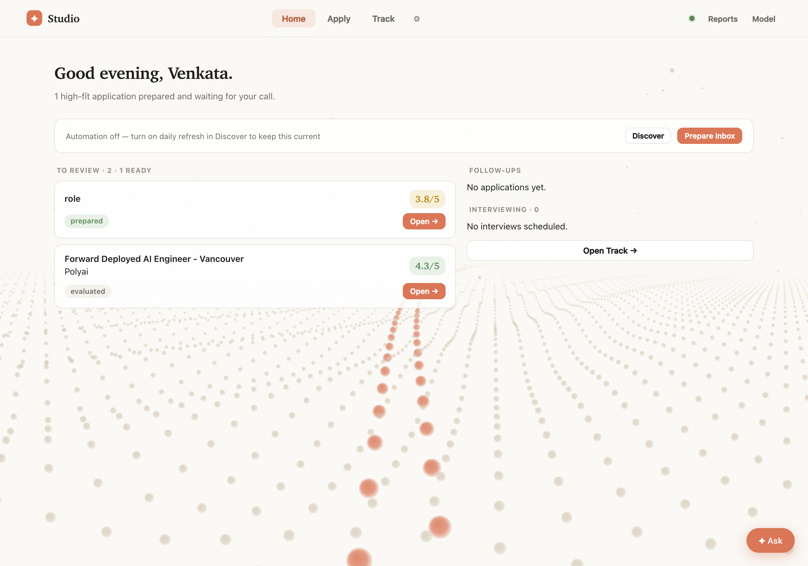
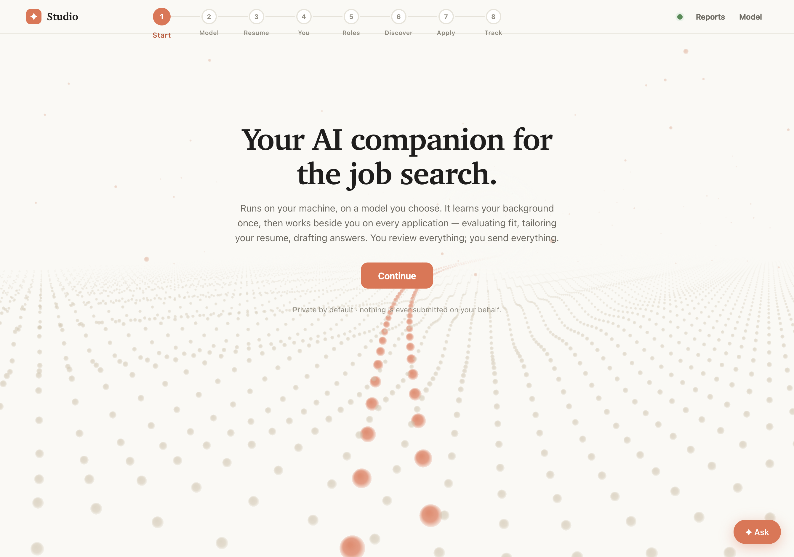
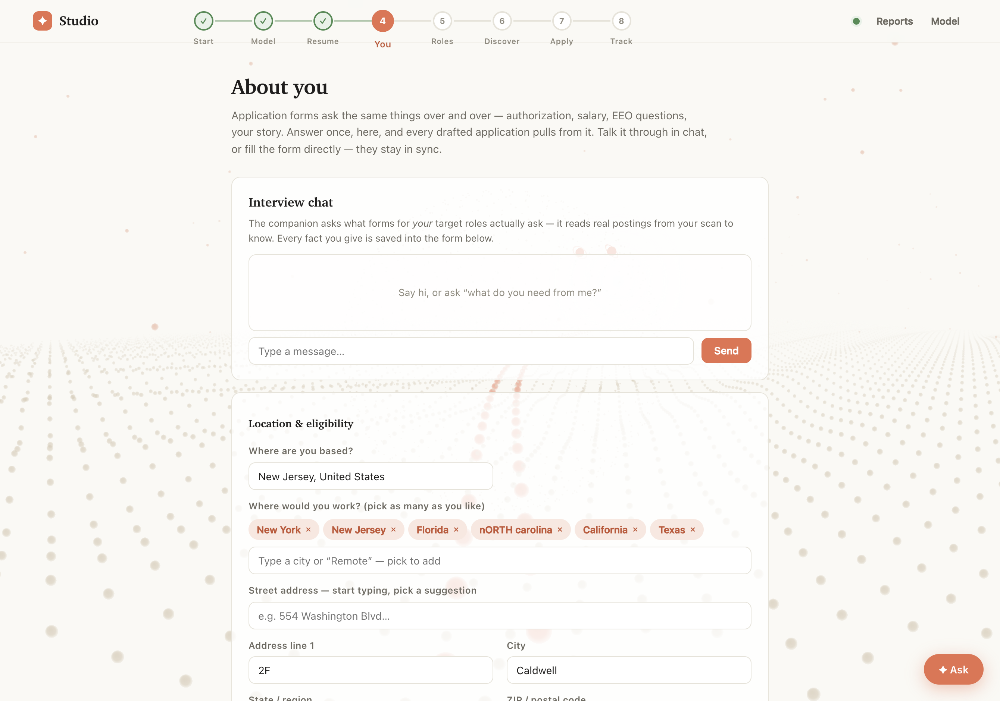
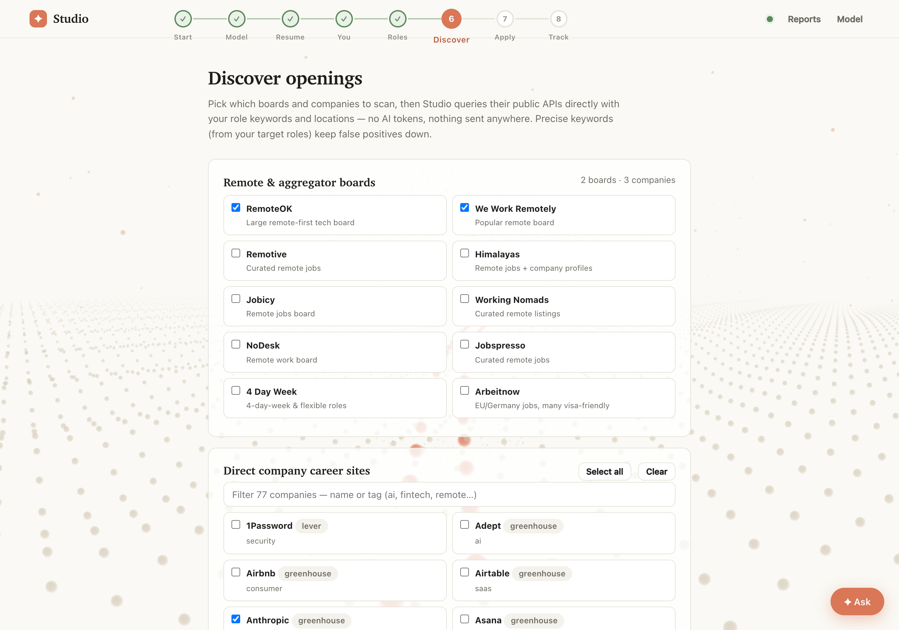
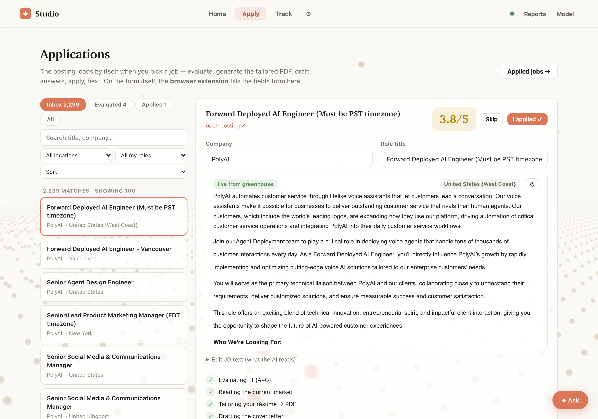
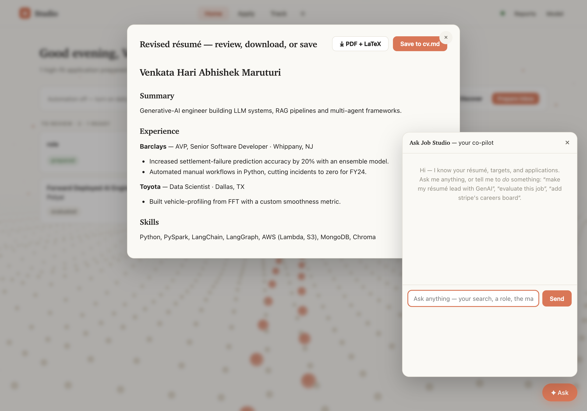
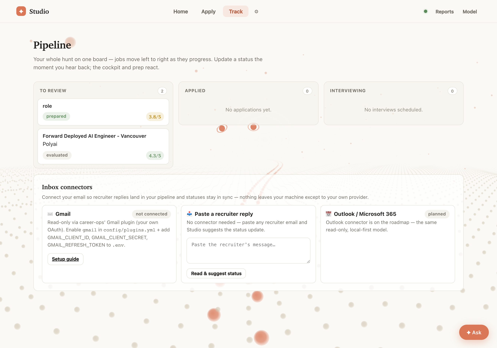

<div align="center">

# ✦ Career-Ops Studio

**A local-first AI cockpit for your job search.**
Bring your own model — a free local Ollama or any API key — and run the whole hunt from one calm screen: discover roles, evaluate fit, tailor your résumé to a real LaTeX PDF, draft answers and cover letters, and track everything through to the interview.

*Your résumé and keys never leave your machine.*



</div>

---

Studio is a **wrapper**, not a fork. It drives the [career-ops](https://github.com/santifer/career-ops) scripts you already have (`scan.mjs`, `ollama-eval.mjs`, `openai-eval.mjs`, the CV/LaTeX pipeline) and only ever writes the same **user-layer** files the CLI uses (`cv.md`, `config/profile.yml`, `portals.yml`). It never touches career-ops system files, so `update-system.mjs` keeps working. No framework, no build step — vanilla HTML/CSS/JS over a zero-dependency Node server.

## Why it's different

- **Bring your own model.** Local Ollama (free, private, offline) or any OpenAI-compatible API — OpenAI, Anthropic, OpenRouter, Groq, DeepSeek, LM Studio, vLLM. Keys stay in `studio/.local/` (gitignored).
- **Local-first.** No account, no cloud, no telemetry leaves the box. Your CV is a file on your disk.
- **It does the work before you sit down.** Scan on a schedule, evaluate in the background, auto-prepare high-fit matches — then just decide.
- **It never fabricates and never auto-submits.** Everything is grounded in your résumé; missing facts become `[ADD: …]`; the submit button is always yours.

## Quick start

```bash
git clone https://github.com/santifer/career-ops
cd career-ops
node studio/setup.mjs        # checks Node, installs deps, finds a model, launches + opens
```

`setup.mjs` is the front door — a preflight doctor (Node 18+, dependencies, a reachable model, a free port) that fixes what it can, then opens `http://localhost:4949`. To just start it: `node studio/server.mjs`.

Local model? Install [Ollama](https://ollama.com) and pull something with headroom:

```bash
ollama pull qwen2.5-coder:32b   # good default; 32B+ recommended — small models embellish
```

---

## The journey → the cockpit

The first run is a short guided **Setup** (Model → Résumé → a quick interview about you → Roles → Boards). After that, Studio opens straight to the **Cockpit** (the screenshot up top) — a ranked queue of already-prepared, high-fit jobs waiting for a yes/no — and Setup collapses into the ⚙ menu.

<table>
<tr>
<td width="50%"></td>
<td width="50%"></td>
</tr>
<tr>
<td><b>Setup, once.</b> Pick your engine, bring your résumé in any format, and you're moving.</td>
<td><b>The interview.</b> Answer what applications always ask — authorization, sponsorship, salary, notice, EEO (optional), your story — once. Talk it through in chat or fill the form; your locations autocomplete to real, validated places and pin on the globe.</td>
</tr>
</table>

**Any-format résumé:** PDF, DOCX, PNG/JPG (via your vision model), LaTeX, Markdown, or plain text. PDFs/DOCX are extracted *in your browser*; your model transcribes faithfully and **you review before it's saved** as `cv.md`, the single source of truth.

## Discover — your boards, your companies



Pick which sources to scan: **13 remote/aggregator boards** (RemoteOK, We Work Remotely, Remotive, Himalayas, Arbeitnow, HN Who's Hiring…) and **75+ direct-company career sites** (Anthropic, Stripe, Figma, Databricks, Notion…), filterable by name or tag. Paste any Greenhouse/Lever/Ashby careers URL to add a company yourself — Studio detects the ATS and verifies it responds. Scanning hits public job-board APIs directly: **zero AI tokens**. Precise phrase-level keywords keep the false positives down.

Below the picker: **Background evaluation** (auto-prepare strong matches while you're away) and **Daily refresh** (re-scan at a set hour; on macOS, one command makes it always-on).

## Apply — one posting at a time, no busywork



Thousands of scanned postings sit in a filterable rail (status tabs, location + role filters, search). Pick one and **the full job description loads itself** from the ATS API — no copy-pasting. Then hit **Prepare this application** and Studio runs the whole chain automatically:

**Evaluate fit (A–G)** → **read the live market** → **tailor your résumé to a PDF** (using the fit + market analysis as context) → **draft the cover letter.**

A stepper shows progress; each result is an expandable section. The tailored résumé has a **collapsible inline chat** to refine it, and everything is saved per-posting so reopening restores it. *"I applied"* tracks it and moves you on — and a browser extension can fill the actual form for you.

### Résumé documents — real LaTeX PDF + `.tex`

Every tailored or regenerated résumé can be downloaded as a **LaTeX-compiled PDF** *and* its **`.tex` source** (Overleaf-ready). Studio structures your résumé once (faithfully — no invention) and builds both through career-ops' own LaTeX template. No LaTeX engine installed? One click installs [tectonic](https://tectonic-typesetting.github.io/) (Homebrew or a prebuilt binary into `studio/.local/`), then compiles locally — no terminal.

## Ask Job Studio — an assistant that *acts*



The floating co-pilot knows your résumé, targets, interview answers, and applications — and it both advises **and does things**. Tell it *"make my résumé lead with GenAI"* or *"add Stripe's careers board and rescan"* and it acts, rendering the result **in the window** (the revised résumé opens on a canvas with Download PDF/LaTeX and Save), while the chat just narrates. It pulls the live web for market and salary questions. It can regenerate/tailor résumés, evaluate, generate PDFs, draft cover letters, mark applied, add companies, scan, and start background prep — with confirmation on anything destructive, and never a fabricated fact or an auto-submit.

## Track — your whole hunt on one board



A three-lane pipeline: **To review → Applied → Interviewing.** Jobs move rightward as they progress. Applied cards show days-since and one-click **follow-up email drafts** when they go quiet; paste any recruiter reply and Studio suggests the status update (no Gmail OAuth needed). For interviews, set a date and get **AI-suggested prep topics** — tick the ones you care about and Studio builds a **time-blocked roadmap to that date**, saved where career-ops' interview modes read it.

## The browser extension

```
chrome://extensions → Developer mode → Load unpacked → select studio/extension/
```

On any application page, click ✦ → **Fill this form**. It's **type-aware**: native selects get *selected*, radio groups *clicked*, custom comboboxes (Greenhouse/react-select — even button-triggered) opened and matched then **verified**, and your latest **tailored PDF attached automatically** to Resume/CV uploads. It **never** ticks a consent box, never auto-answers EEO questions from anything but your explicit choices, and never submits. On submission it offers, one click, to mark the job Applied so your tracker stays in sync.

Safety is enforced server-side, not just prompted: your interview answers are authoritative (a model once turned "2 weeks" into "30 days" — caught), and sensitive fields stay blank unless you've answered them.

## Run it like a Mac app (optional)

No Electron, no build. On macOS:

- **Double-click** `studio/mac/launch.command` — starts the server and opens Studio.
- **Always-on:** `bash studio/mac/install.sh` installs a `launchd` agent so Studio starts at login, restarts if it crashes, and the daily refresh fires even when the app is closed. Remove with `--remove`.

*Why not a packaged `.app`?* Electron/Tauri would add ~150 MB and a build step, breaking the zero-dependency, cross-platform, publish-to-GitHub design. `launchd` gets you "always-on + scheduled" natively.

## Safety & ethics

- **Local-first** — CV and keys never leave your machine except to the model endpoint you choose.
- **Never auto-submits** — Studio drafts, tailors, and fills up to the submit button; you press it.
- **Quality over quantity** — sub-4/5 fits are flagged as not worth applying to.
- **No fabrication** — everything is grounded in your résumé; gaps become `[ADD: …]` placeholders.

## Architecture

```
studio/
├── setup.mjs            # first-run doctor + launcher (node studio/setup.mjs)
├── server.mjs           # zero-dependency Node server (stdlib http only)
├── public/              # vanilla HTML/CSS/JS — no framework, no build step
├── extension/           # Chrome/Edge form-filler (load unpacked)
├── mac/                 # double-click launcher + launchd always-on install
├── data/                # generated catalogs (roles, boards) + build scripts
├── scripts/             # smoke tests, screenshot capture, catalog builders
└── .local/              # your settings, keys, per-job artifacts (gitignored)
```

Run the tests: `npm test` (boots the server on a scratch dir, checks 21 endpoints — no model needed).

## Sharing it with others

Local-first makes it safe to hand around. `node studio/setup.mjs` is the whole onboarding. The extension installs unpacked today (Chrome Web Store is the next step). career-ops ships a `Dockerfile` if you'd rather not put Node on the host.

## Credits

Built as a community wrapper around [santifer/career-ops](https://github.com/santifer/career-ops). The evaluation logic, scanner, and CV/LaTeX pipeline are career-ops' own — Studio gives them a cockpit.

---

*This repository packages **Career-Ops Studio**. The upstream career-ops CLI documentation is preserved at [README.career-ops.md](README.career-ops.md).*
